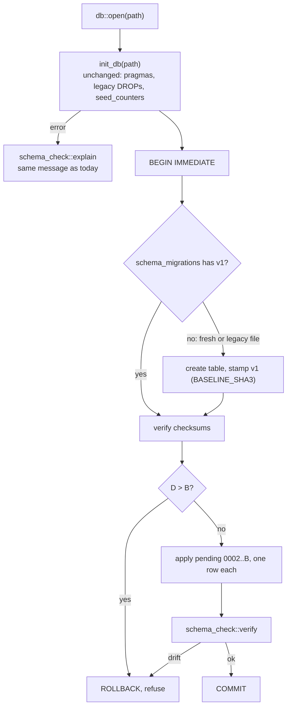
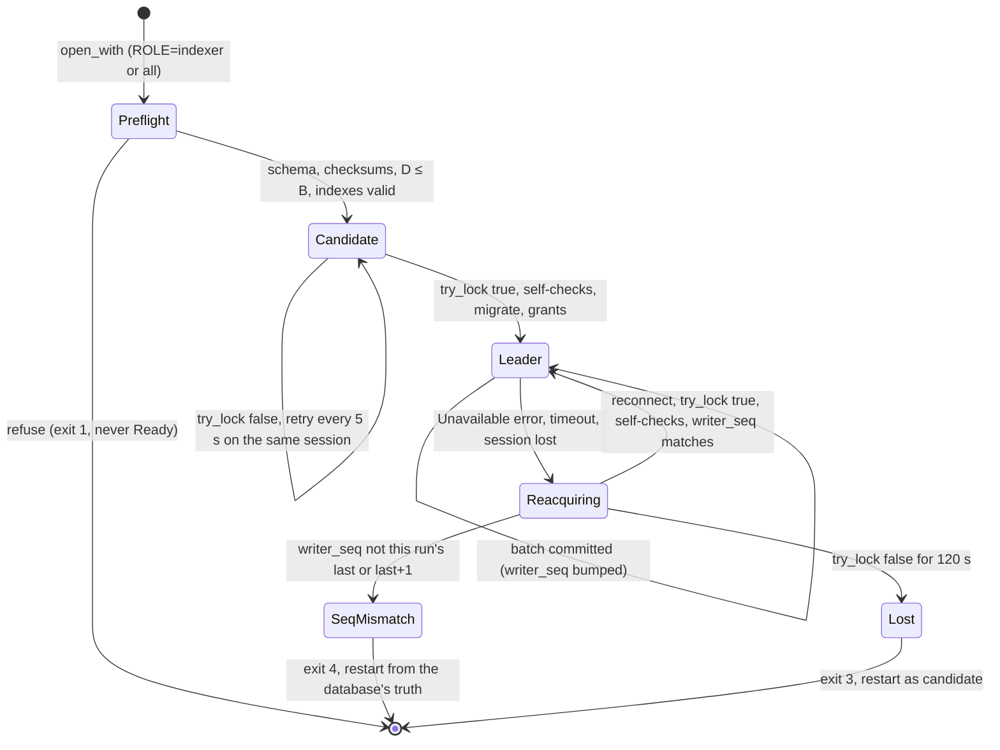
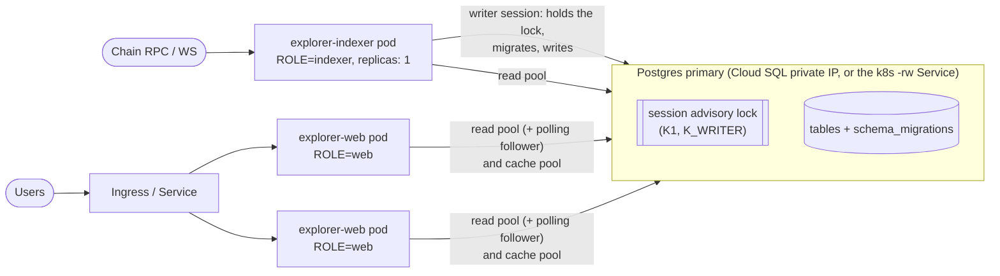

# Phase 3: Postgres as a second permanent backend

Status: draft, awaiting review
Date: 2026-10-03
Follows: `2026-10-01-db-boundary-design.md` (phase 1) and
`2026-10-02-schema-two-dialects-design.md` (phase 2)

## Why

The explorer runs on SQLite today. Production moves to Postgres: either
Cloud SQL for PostgreSQL in the same GCP region as the explorer, or a
Postgres running in Kubernetes. SQLite stays permanently, for development
and single-binary self-hosting.

Phase 1 sealed the database boundary. Phase 2 added a Postgres schema and
the tests that hold it to `init_db`. This phase adds:

- the Postgres backend;
- versioned migrations on both backends;
- a split web/indexer deployment;
- tests that compare the baseline fixtures on Postgres.

### Decisions this spec is built on

Made in brainstorming on 2026-10-03:

1. **Where it runs.** On GCP, in the same region as the database. The
   deployment examples are for Kubernetes only.
2. **Postgres targets.** Cloud SQL for PostgreSQL, or Postgres in
   Kubernetes (an operator such as CloudNativePG). The design must work on
   both.
3. **Topology.** Split deployments built from one image:
   - one indexer process, the only writer, which holds a session-level
     advisory lock and runs migrations;
   - N web replicas that serve pages.

   `ROLE=all|web|indexer` picks the role at runtime. `all` stays the
   default.
4. **Upstream is the same team.** `yihuang/nvnmchain-explorer`, where
   teammates commit daily, takes this work; PR #44 already carries phases 1
   and 2. A coordinated one-time change to `web.rs`, `indexer.rs` and the
   tests is acceptable, so the phase 1 and 2 rules that kept those files
   untouched are relaxed.
5. **The public `db::*` API becomes native async** (section 1).
6. **Both backends are permanent.** Every query and every schema change
   exists for both, and tests hold them together.
7. **Least change to existing SQLite code.** The rusqlite query bodies,
   `init_db`, `seed_counters`, `schema_check` and the per-row writer stay
   as they are: moved, not rewritten.
8. **Versioned migrations on both backends**, run by the indexer under the
   lock. Existing SQLite files are adopted.
9. **The first production Postgres is re-indexed from the chain.** There is
   no SQLite importer.
10. **Integration tests compare the baseline fixtures on Postgres too.**

### What this phase delivers

- **One async API, two backends.** A native async `db::*` API in front of
  SQLite and Postgres. The SQLite arm calls today's code inline, so SQLite
  behaviour does not change.
- **A hand-written Postgres backend** on sqlx 0.9. Its writer is set-based:
  at most 14 round trips per 64-block batch, against about 642 statements
  per batch today.
- **One writer per database.** The writer is fenced by the session that
  holds a session-level advisory lock, and it survives failover without
  losing a block.
- **Versioned migrations on both backends.** On SQLite, migration 1 is the
  frozen `init_db`.
- **Split roles.** `ROLE=web` and `ROLE=indexer`, with a polling live feed
  for web replicas, lock-free readiness, and a 503 when the database is
  down.
- **Tests on both backends.** The existing suites run on both, the baseline
  fixtures are replayed and re-indexed into Postgres, and the two backends
  are compared with each other.
- **Operations.** Kubernetes manifests, a runbook, and a cutover tool with a
  stop-at-height control.

## 1. Sync vs async

**Decision: a native async `db::*` API. The SQLite arm calls the moved
rusqlite functions inline.**

Three options were compared against the tokio and sqlx sources and a
microbenchmark:

- **A.** Async API; every SQLite call goes through `spawn_blocking`.
- **B.** Sync API plus a `block_in_place` bridge into a private runtime.
  This was the phase 2 plan.
- **C1.** Async API; SQLite is called inline. This is the decision.

|                                               | A                                                               | B                                                                                                                                           | C1                                   |
|-----------------------------------------------|-----------------------------------------------------------------|---------------------------------------------------------------------------------------------------------------------------------------------|--------------------------------------|
| Tests vs production                           | Same path                                                       | `block_in_place` panics on a current-thread runtime. 45 of the 47 async DB tests run on one, so tests take a different path than production | Same path                            |
| Cancellation (timeouts, disconnects, SIGTERM) | A Postgres read cancels cleanly                                 | A call cannot be cancelled, and shutdown waits for it                                                                                       | As A                                 |
| How mistakes surface                          | Compile errors                                                  | Runtime panics or hangs (tokio#7892 deadlock; a runtime dropped inside async code)                                                          | Compile errors                       |
| SQLite cost per call                          | About 7 µs, `'static` argument copies, and one signature change | 0                                                                                                                                           | 0, with behaviour identical to today |
| Runtimes, for as long as both backends exist  | 1                                                               | 2, permanently                                                                                                                              | 1                                    |
| Caller churn                                  | About 360–400 lines, once                                       | 0                                                                                                                                           | About 360–400 lines, once            |

Why C1:

- **B's bridge would be permanent, because both backends are.** Its one
  advantage, no caller churn, mattered while upstream was treated as an
  outside party. An upstream-merge probe measured that tax: 59% of
  upstream commits conflicted, at about 30–45 minutes per sync. Under
  decision 4 the cost is paid once.
- **A taxes every SQLite call and buys nothing C1 lacks.** Any single
  function can still move to `spawn_blocking` later by changing one marker
  in `db/mod.rs`, without touching callers.
- **Speed is not the reason.** At about 1 ms to a same-region database, the
  number of round trips sets page time under any option. The set-based
  writer and the token-label cache are needed under all three.
- **A forgotten `.await` fails CI.** `let _ = db::x()` trips
  `clippy::let_underscore_future`, and a bare `db::x();` trips
  `unused_must_use`. Both lints are on by default, and CI runs
  `-D warnings`.

**Once started, a write completes on both backends.**

- An inline SQLite call runs to completion, as it does today.
- A Postgres write runs its transaction on a spawned task (section 6), so a
  dropped caller (a disconnected client, a request timeout) never cancels a
  write halfway.
- Postgres reads can be cancelled.

**What would flip this decision:** if the team cannot take the conversion
into `yihuang/main` within about two weeks, this is a fork again, and B
becomes the fallback.

## 2. Module layout

| Path                                                      | Owns                                                                                                                                                                                                                 | New lines (est.) |
|-----------------------------------------------------------|----------------------------------------------------------------------------------------------------------------------------------------------------------------------------------------------------------------------|------------------|
| `src/db/mod.rs`                                           | `Db`, `Backend`, `Role`, `DbConfig`, `DbUrl`, `open`, `open_with`, `status`, `keepalive`, the `db_fn!` list (45 entries), the hand-written `save_anchoring_window`, the token-label cache, test hooks, the seal test | ~450             |
| `src/db/sqlite.rs`                                        | `git mv src/db.rs`: upstream's code                                                                                                                                                                                  | section 4        |
| `src/db/indexer_jobs.rs`, `src/db/schema_check.rs`        | Unchanged paths, loaded through `#[path]` from `sqlite.rs`                                                                                                                                                           | section 4        |
| `src/db/sqlite/migrate.rs`                                | SQLite runner (v1 = `init_db`), shape hash, `init_db` pins, commute guard                                                                                                                                            | ~160             |
| `src/db/sqlite/extra.rs`                                  | New SQLite queries, which never edit existing ones (e.g. `tokens_missing_metadata`)                                                                                                                                  | ~40              |
| `src/db/migrations.rs`                                    | Shared version list (`include_str!` of both dialects), header parsing, checksums, the web schema gate                                                                                                                | ~220             |
| `src/db/pg/mod.rs`                                        | `PgDb`, pools, connect options, TLS policy, the version floor, session settings, `DbError` and its classifier, `DB_FAILED`, preflight                                                                                | ~350             |
| `src/db/pg/writer.rs`                                     | Candidate loop, lock and self-checks, spawned and cancel-safe `with_txn`, budgets, watchdog, lease, `writer_seq`, leadership watch                                                                                   | ~380             |
| `src/db/pg/q.rs`                                          | `query_rows`, `query_opt`, `try_query_opt`, `query_count`, `fetch_one`, `fetch_all`, `exec`, `exec_best_effort`, all with client deadlines; statement counter                                                        | ~170             |
| `src/db/pg/shared.rs`                                     | Copies of `hex_blob`, `blob_hex`, `blob_addr`, `bigint`; column-list macros; the `HOLDING` text                                                                                                                      | ~70              |
| `src/db/pg/{blocks,txs,tokens,transfers,kv,selectors}.rs` | Read SQL and row mappers                                                                                                                                                                                             | ~1,200           |
| `src/db/pg/plan.rs`                                       | Pure batch planner: dedup, net balance deltas, holder deltas                                                                                                                                                         | ~200             |
| `src/db/pg/{write,jobs,migrate}.rs`                       | Set-based writes, jobs, the Postgres runner and grants                                                                                                                                                               | ~900             |
| `src/follow.rs`                                           | The web-role polling follower: live blocks, stats, schema gate, label-cache refresh                                                                                                                                  | ~150             |
| `migrations/postgres/0001_baseline.sql`                   | `src/db/schema_pg.sql`, moved; `idx_tb_holding` gains `holder_addr`                                                                                                                                                  | moved            |
| `migrations/{sqlite,postgres}/NNNN_name.sql`              | Schema changes from 0002 on                                                                                                                                                                                          | —                |
| `tests/cutover.rs`                                        | `#[ignore]`d cutover comparison (section 10)                                                                                                                                                                         | ~250             |
| `deploy/k8s/`                                             | Manifests, secrets template and README (section 8)                                                                                                                                                                   | —                |

The module root is `src/db/mod.rs`, not a new `src/db.rs`. Deleting
`src/db.rs` lets git pair the rename, so teammates' edits to `src/db.rs`
merge into `src/db/sqlite.rs`.

## 3. The async API and dispatch

```rust
#[derive(Clone)]
pub struct Db(Arc<Inner>);                    // Inner { backend: Backend, labels: LabelCache }
enum Backend { Sqlite(sqlite::Db), Postgres(Box<pg::PgDb>) } // Box: clippy large_enum_variant
#[derive(Clone, Copy)]
pub enum Role { All, Web, Indexer }

/// Every test's call text still works: `postgres://` or `postgresql://`
/// picks Postgres, anything else is a SQLite path. Role::All.
pub async fn open(path_or_url: &str) -> anyhow::Result<Db>;
/// main.rs: role, URL, TLS material, and the status channel /readyz reads.
pub async fn open_with(cfg: &DbConfig, status: watch::Sender<Status>) -> anyhow::Result<Db>;

macro_rules! db_fn {
    (@call inline $s:ident $n:ident ($($a:ident),*)) => { sqlite::$n($s, $($a),*) };
    (@call extra $s:ident $n:ident ($($a:ident),*)) => { sqlite::extra::$n($s, $($a),*) };
    (@call blocking $s:ident $n:ident ()) => {{
        let h = $s.clone();
        match tokio::task::spawn_blocking(move || sqlite::$n(&h)).await {
            Ok(r) => r,
            Err(e) => std::panic::resume_unwind(e.into_panic()),
        }
    }};
    ($( $side:ident fn $n:ident($($a:ident: $t:ty),*) -> $r:ty; )*) => {$(
        pub async fn $n(db: &Db, $($a: $t),*) -> $r {
            match &db.0.backend {
                Backend::Sqlite(s) => db_fn!(@call $side s $n ($($a),*)),
                Backend::Postgres(p) => pg::$n(p, $($a),*).await,
            }
        }
    )*};
}

db_fn! {
    inline   fn get_block_by_number(number: i64) -> Option<Block>;
    inline   fn get_token_holders(token_addr: &str, page: u32, per_page: u32) -> Vec<(String, String)>;
    inline   fn save_block_bundles(bundles: &[BlockBundle]) -> Result<()>;
    blocking fn repair_derived_tables() -> ();
    extra    fn try_min_block_number() -> anyhow::Result<Option<i64>>;
    // … 40 more, one line each: 42 inline, 1 blocking, 2 extra
}
```

A missing Postgres twin fails to compile, because `pg::$name` must exist.

**Function classes**

| Class                                                                                                                | Change                                                                                                                                                                                                         |
|----------------------------------------------------------------------------------------------------------------------|----------------------------------------------------------------------------------------------------------------------------------------------------------------------------------------------------------------|
| `now_ts`, `page_offset`, `Holder`, `TxColumns` and the row types                                                     | `pub use sqlite::…`, unchanged                                                                                                                                                                                 |
| 42 `&Db` I/O functions                                                                                               | `fn` → `async fn` through `db_fn!`, inline on SQLite, with the same parameters and return types                                                                                                                |
| `repair_derived_tables`                                                                                              | `db_fn!` with the `blocking` marker. Today it rebuilds whole tables on a runtime worker (`indexer.rs:985`)                                                                                                     |
| `try_min_block_number` (new, `extra`)                                                                                | `-> anyhow::Result<Option<i64>>`. Its SQLite twin in `sqlite/extra.rs` is `Ok(get_min_block_number(s))`, so SQLite behaviour is unchanged; the Postgres arm returns the error instead of degrading (section 6) |
| `tokens_missing_metadata` (new, `extra`)                                                                             | Token addresses referenced by `transfer_events.token_addr` or `transactions.fee_token` that have no `token_metadata` row. The SQLite twin lives in `sqlite/extra.rs`                                           |
| `save_anchoring_window`                                                                                              | Hand-written wrapper. The public bound changes from `FnOnce` to `Fn + Send`; the one caller (`indexer.rs:576-580`) only adds `.await`                                                                          |
| `keepalive` (new)                                                                                                    | Postgres: `SELECT 1` on the writer session, bounded to 5 s. SQLite: nothing                                                                                                                                    |
| `token_label(db, addr) -> Option<String>` (new, sync)                                                                | Reads the label cache. Used by the Tera `address_label` function (`web.rs:2284-2290`)                                                                                                                          |
| `#[doc(hidden)] pub use sqlite::{init_db, counter, get_block_timestamp, rebuild_token_balances, sync_holder_counts}` | Sync, SQLite-only test hooks, unchanged                                                                                                                                                                        |
| `pub fn lock(db: &Db) -> MutexGuard<'_, Connection>`                                                                 | Same text. SQLite: `sqlite::lock(s)`. Postgres: panics "SQLite-only test hook"                                                                                                                                 |

**The 7 `db::lock` call sites in tests stay byte-identical**
(`decoder.rs:685,772,859,1040`, `pages.rs:764`, `live_rpc.rs:435`,
`write_scale.rs:75`). Holding the guard across an `.await` would deadlock,
and `clippy::await_holding_lock` rejects that under `-D warnings`.

**The token-label cache** replaces the per-row `get_token_metadata` lookup
behind Tera's `address_label`, which is sync and cannot await. It is
`RwLock<HashMap<addr, label>>` in `Db`:

- seeded at open from `get_all_token_metas`;
- updated in the `db/mod.rs` wrappers after a successful
  `save_token_metadata` and after each `save_block_bundle(s)` commit, for
  the bundled token metadata. `ROLE=all` labels are therefore immediate,
  as today, with no change to the rusqlite bodies;
- reloaded from `get_all_token_metas` every 30 s in every role, which is how
  web replicas see the indexer's inserts and repairs. A failed or empty
  seed is retried the same way.

**Anchoring on Postgres takes two passes.** SQLite passes the closure to its
unchanged body. Postgres:

1. Calls `events` with a stamp that records each requested block number and
   returns `None`. `anchoring_event_from_log` returns at `stamp(..)?` before
   decoding (`indexer.rs:595-596`), so this pass is cheap.
2. Inside the writer transaction, runs
   `SELECT number, timestamp FROM blocks WHERE number = ANY($1)`.
3. Calls `events(&|n| map.get(&n).copied())`, inserts the events
   set-based, sets the watermark and commits.

The closure must be deterministic. The only caller's closure is pure over
`logs`.

### Worked example: `get_block_by_number`

SQLite is unchanged (`db.rs:583-591`). Postgres:

```rust
pub(crate) async fn get_block_by_number(p: &PgDb, number: i64) -> Option<Block> {
    q::query_opt(&p.read, "get_block_by_number",
        concat!("SELECT ", block_cols!(), " FROM blocks WHERE number = $1"),
        |q| q.bind(number), rows::block).await
}
```

- **`q::query_opt` keeps SQLite's degrade rule.** An error is logged and
  becomes `None`. It also sets `DB_FAILED` and has a client deadline
  (section 6).
- **`concat!` yields the `&'static str` that sqlx requires.** sqlx's
  `SqlSafeStr` takes only a static string (`sqlx-core-0.9.0/src/sql_str.rs:52`).
- **The column lists cannot drift.** A unit test inside `sqlite/migrate.rs`
  asserts `block_cols!() == BLOCK_COLS` (`db.rs:457`). The same holds for
  `TX_COLS`, `TX_LIST_COLS`, `TOKEN_COLS`, `TRANSFER_COLS` and `HOLDING`.
  As a child of `sqlite`, that module can read the private consts, so no
  SQLite visibility changes.

### Worked example: `get_token_holders`

```sql
-- SQLite: unchanged (db.rs:1524-1526). Ties come out in index order.
SELECT holder_addr, balance FROM token_balances WHERE token_addr=?1 AND balance NOT LIKE '-%'
ORDER BY LENGTH(balance) DESC, balance DESC LIMIT ?2 OFFSET ?3

-- Postgres (pg/tokens.rs): adds a tie-break so pages are stable.
SELECT holder_addr, balance FROM token_balances WHERE token_addr = $1 AND balance NOT LIKE '-%'
ORDER BY LENGTH(balance) DESC, balance DESC, holder_addr LIMIT $2 OFFSET $3

-- migrations/postgres/0001_baseline.sql
CREATE INDEX IF NOT EXISTS idx_tb_holding ON token_balances
  (token_addr, LENGTH(balance) DESC, balance DESC, holder_addr) WHERE balance NOT LIKE '-%';
```

- The predicate text matches the index predicate, so the planner can prove
  the partial index applies.
- `tests/postgres.rs`'s `TRANSLATED` pin is updated for the Postgres side.
- Tests compare tie groups across all pages (section 9).

### Worked example: `save_block_bundles`

**SQLite** is unchanged (`db.rs:512-560`): one transaction, per-row
`prepare_cached` statements, and `adjust_balance`.

**Postgres** is set-based, in one transaction on the session that holds the
lock:

```rust
pub(crate) async fn save_block_bundles(p: &PgDb, bundles: &[BlockBundle]) -> Result<()> {
    if bundles.is_empty() { return Ok(()); }
    let plan = plan::BatchPlan::new(bundles); // blocks/txs/tokens last-wins; transfers/anchoring first-wins
    p.writer()?.write(Budget::Batch, move |c| Box::pin(async move {
        let (new_txs, stored): (i64, i64) = q::fetch_one(c, "probe", PROBE, plan.probe_binds()).await?;
        q::exec(c, "blocks", UPSERT_BLOCKS, plan.block_binds()).await?;
        q::exec(c, "txs", UPSERT_TXS, plan.tx_binds()).await?;
        q::exec(c, "counters", BUMP_COUNTERS, (plan.len() as i64 - stored, new_txs)).await?;
        let fresh: Vec<(i64, i64)> = q::fetch_all(c, "transfers", INSERT_TRANSFERS, plan.transfer_binds()).await?;
        q::exec(c, "anchoring", INSERT_ANCHORING, plan.anchoring_binds()).await?;
        q::exec(c, "tokens", UPSERT_TOKENS, plan.token_binds()).await?;   // metadata before balances
        let old = q::fetch_all(c, "balances", READ_BALANCES, plan.balance_keys(&fresh)).await?;
        let out = plan.apply(&fresh, old);  // same rule as adjust_balance (db.rs:1169-1206); 0 ⇒ delete
        q::exec(c, "upsert_bal", UPSERT_BALANCES, out.upserts()).await?;
        q::exec(c, "delete_bal", DELETE_BALANCES, out.deletes()).await?;
        q::exec(c, "holders", BUMP_HOLDERS, out.holder_deltas()).await?;
        Ok(())
    })).await
}
```

`write` owns the plan, runs the closure on a spawned task, and adds the
`writer_seq` bump (section 6). Statements with nothing to do are skipped.

```sql
-- PROBE: the per-block counter semantics of db.rs:527-539
SELECT COALESCE(SUM(GREATEST(u.n - (SELECT COUNT(*) FROM transactions t WHERE t.block_number = u.num), 0)), 0)::int8,
       (SELECT COUNT(*) FROM blocks WHERE number = ANY($1))
FROM UNNEST($1::int8[], $2::int8[]) AS u(num, n);

-- UPSERT_BLOCKS: one INSERT … SELECT FROM UNNEST($1::int8[], $2::bytea[], …)
--   ON CONFLICT (number) DO UPDATE SET …, with the same columns as upsert_block.

-- BUMP_COUNTERS: qualify the target column; a bare `n` is ambiguous on Postgres (db.rs:400)
INSERT INTO counters (name, n) VALUES ('blocks', $1), ('transactions', $2)
ON CONFLICT (name) DO UPDATE SET n = counters.n + excluded.n;

-- INSERT_TRANSFERS: RETURNING gives exactly the rows insert_transfer reports as new
INSERT INTO transfer_events (tx_hash, block_number, log_index, token_addr, from_addr, to_addr, amount, timestamp, created_at)
SELECT * FROM UNNEST($1::bytea[], $2::int8[], $3::int8[], $4::bytea[], $5::bytea[], $6::bytea[], $7::text[], $8::int8[], $9::int8[])
ON CONFLICT (block_number, log_index) DO NOTHING RETURNING block_number, log_index;

-- UPSERT_TOKENS: holder_count seeded from balances, as upsert_token_meta does (db.rs:908-933)
INSERT INTO token_metadata (address, name, symbol, decimals, currency, total_supply, logo_uri, holder_count, created_at, updated_at)
SELECT u.a, u.n, u.s, u.d, u.c, u.t, '',
       (SELECT COUNT(*) FROM token_balances b WHERE b.token_addr = u.x AND b.balance NOT LIKE '-%'), $8, $8
FROM UNNEST($1::bytea[], $2::text[], $3::text[], $4::int8[], $5::text[], $6::text[], $7::text[]) AS u(a, n, s, d, c, t, x)
ON CONFLICT (address) DO UPDATE SET name = excluded.name, symbol = excluded.symbol, decimals = excluded.decimals,
  currency = excluded.currency, total_supply = excluded.total_supply, updated_at = excluded.updated_at;

-- BUMP_HOLDERS
UPDATE token_metadata m SET holder_count = m.holder_count + u.by, updated_at = $3
FROM UNNEST($1::bytea[], $2::int8[]) AS u(addr, by) WHERE m.address = u.addr;
```

**Cost per batch.** At most 14 round trips: BEGIN, 11 statements, the
`writer_seq` bump and COMMIT. Today's per-row path costs 642 for the
`write_scale` block shape.

**Equivalence with the per-row path.** Netting the deltas per (token,
holder) telescopes to the same final balances and holder counts. The
planner property test and the differential test pin this (section 9).

**The jobs become set-based on Postgres only.** Postgres has no
Keccak-256, so the EIP-55 checksummed text keys of `token_balances` and
`genesis_balances` are always made in Rust with `checksum_address`.

- **`rebuild_token_balances`** runs in one writer transaction on the `Long`
  budget:
  1. `DELETE FROM token_balances`.
  2. One aggregate keyed on bytes:
     ```sql
     SELECT tok, holder, SUM(d)::text FROM (
       SELECT token_addr tok, from_addr holder, -(amount::numeric) d FROM transfer_events
       UNION ALL SELECT token_addr, to_addr, amount::numeric FROM transfer_events
       UNION ALL SELECT decode(substr(token_addr, 3), 'hex'), decode(substr(holder_addr, 3), 'hex'),
                        balance::numeric FROM genesis_balances) s
     GROUP BY tok, holder HAVING SUM(d) <> 0
     ```
     This keeps `adjust_balance`'s rule: a zero balance has no row, and
     negative balances are kept.
  3. Checksum both keys of each row in Rust.
  4. Insert in chunks with `INSERT … SELECT FROM UNNEST($1::text[], $2::text[], $3::text[])`.
  5. Recount the holders with the set-based `sync_holder_counts`.
- **`sync_holder_counts`** becomes one `UPDATE … FROM (… GROUP BY)`.
- **`holders_without_genesis_balance`** takes two round trips instead of up
  to 2,000 `EXISTS` probes:
  1. Read the cursor and the transfer page (`id > $1 ORDER BY id LIMIT $2`)
     as bytes.
  2. Checksum and dedupe the addresses in Rust, dropping `ZERO_ADDRESS`.
  3. Anti-join on the primary key:
     `SELECT u.t, u.h FROM UNNEST($1::text[], $2::text[]) AS u(t, h) WHERE NOT EXISTS (SELECT 1 FROM genesis_balances g WHERE g.token_addr = u.t AND g.holder_addr = u.h)`.

  A failed cursor read is an error, never a cursor of 0.
- **`save_genesis_balances`** writes with `UNNEST`.

## 4. The SQLite path

**Changes to existing SQLite code: −3/+6 lines now.** These counts were
measured on a scratch copy, where all 26 moved unit tests pass.

| Stage | File:line                          | Change                                                                                                                                                                        | Δ      |
|-------|------------------------------------|-------------------------------------------------------------------------------------------------------------------------------------------------------------------------------|--------|
| 1     | `src/db.rs` → `src/db/sqlite.rs`   | `git mv`                                                                                                                                                                      | rename |
| 1     | `sqlite.rs` (was `db.rs:425-426`)  | `#[path = "indexer_jobs.rs"]` and `#[path = "schema_check.rs"]` on the existing `mod` lines, so both files stay in `src/db/` (`schema_check.rs:767` includes `../indexer.rs`) | +2     |
| 1     | `indexer_jobs.rs:10`               | `use crate::db::{self, Db};` → `use crate::db::sqlite::{self as db, Db};`                                                                                                     | −1/+1  |
| 1     | `schema_check.rs:419` (tests)      | `use crate::db;` → `use crate::db::sqlite as db;`                                                                                                                             | −1/+1  |
| 2     | `sqlite.rs` (was `db.rs:421`)      | `schema_check::verify(&conn)…` → `migrate::run(&conn).with_context(\|\| format!("schema of {path}"))?;`                                                                       | −1/+1  |
| 2     | `sqlite.rs`, after the `mod` lines | `mod migrate; pub(crate) mod extra;` (→ `src/db/sqlite/{migrate,extra}.rs`)                                                                                                   | +1     |

**When the first SQLite 0002 lands**, `schema_check.rs` gains a version
bound, a few lines:

- `expected()` becomes `expected(upto)`: `init_db(":memory:")` plus the
  bodies 0002..`upto`.
- `verify` uses `expected(B)`.
- `explain` reads the file's own `MAX(version)` (1 when there is no table),
  clamps it to B, and compares against `expected(that)`.
- Pending versions are reported on their own line, never as drift with a
  recovery hint.

**Unchanged:**

- every SQL string, including the tie order;
- the pragmas (`db.rs:153-172`);
- `init_db`, its legacy DROPs, `seed_counters` and `HOLDING`;
- the per-row writer and `adjust_balance`;
- `save_anchoring_window`'s body;
- `schema_check`'s comparison and its recovery text;
- the seal test (`indexer_jobs.rs:268-297`, which skips `src/db/`).

**The runtime is unchanged too.** There is one `Mutex<Connection>`, called
inline, and no reader pool. Only `repair_derived_tables` runs on the
blocking pool.

**New SQLite queries go in `sqlite/extra.rs`.** For now that is
`try_min_block_number` and `tokens_missing_metadata`, so existing bodies are
never edited. `db_fn!`'s `extra` marker calls them.

**Postgres copies the helpers it needs** into `pg/shared.rs` (about 30
lines), instead of widening their visibility in `sqlite.rs`. The parity
grid proves the copies agree.

## 5. Migrations on both backends

### The model

- **One shared list.** `migrations.rs` declares
  `migrations!{ 1 => "baseline", … }`.
- **D and B.** Two numbers used throughout this section:
  - **D** is the database's version: the highest `version` in its
    `schema_migrations` table.
  - **B** is the binary's version: the last entry in the `migrations!`
    list compiled into the running image.
  - D < B means this release brings migrations to apply. D > B means a
    newer release already migrated this database, and this binary is older
    than the schema.
- **Version 1.**
  - On SQLite, version 1 **is** the frozen `init_db`: a Rust step with no
    DDL file.
  - On Postgres, it is `migrations/postgres/0001_baseline.sql`, which is
    phase 2's `schema_pg.sql` moved. Its only change is `holder_addr` in
    `idx_tb_holding`, and it seeds no rows.
- **From 0002 on, every version is a twin pair**
  (`migrations/sqlite/NNNN_name.sql` and `migrations/postgres/NNNN_name.sql`),
  with the same number and name.
- **Headers:**
  - `-- kind: expand|contract`: required, and equal in both twins.
  - `-- web-safe-from: S`: required on `contract` files. S is the latest
    version at the commit where the code stopped using the object.
  - `-- no-transaction`: Postgres only (rules below).
  - `-- noop: sqlite-only` or `-- noop: postgres-only`: for a backend with
    nothing to do.
- **A header test checks:** contiguous versions, twin pairing, matching
  kinds and well-formed headers. It also enforces the no-transaction rules
  and forbids, in transactional Postgres files, `DROP INDEX` without
  `CONCURRENTLY` and `CREATE INDEX` without `CONCURRENTLY` on
  `transactions` and `transfer_events`.

**Table** (the same on both backends, with INTEGER types on SQLite):

```sql
CREATE TABLE IF NOT EXISTS schema_migrations (
  version BIGINT PRIMARY KEY, name TEXT NOT NULL, checksum TEXT NOT NULL,
  kind TEXT NOT NULL, web_safe_from BIGINT, applied_at BIGINT NOT NULL, applied_by TEXT NOT NULL);
```

`schema_check` ignores tables that exist only in the file
(`schema_check.rs:16-18`), so this table is invisible to `verify` and
`explain`.

### Checksums and immutability

- **Checksum of a file:** sha3-256 of its `include_str!` text, with CRLF
  normalized, computed when the process starts.
- **SQLite v1's checksum:** the constant `BASELINE_SHA3`. It is the sha3 of
  `SELECT type, name, tbl_name, sql FROM sqlite_master ORDER BY type, name`
  over `init_db(":memory:")`.
- **At runtime:** the indexer refuses a mismatch with "migration N was
  edited after it was applied". Web replicas check versions and kinds only,
  never checksums.
- **In PRs:** a CI step fails when any path under `migrations/` is
  modified, deleted or renamed relative to the base branch. Merged files are
  immutable, so the fix is always a new version. The step uses
  `git diff --name-status origin/main...HEAD -- migrations/` with
  `fetch-depth: 0`. There is no committed checksum file to regenerate.

### Freezing `init_db`

Upstream changed `init_db` about 21 times in two months. From stage 2 on,
schema changes go into migration pairs, and two tests enforce that:

- **Pin A:** `shape_hash(init_db(":memory:")) == BASELINE_SHA3`. It catches
  DDL and `HOLDING` edits.
- **Pin B:** the sha3 of `init_db`'s whole body, read through
  `include_str!("../sqlite.rs")`, with the `pragma_update` and `cache_kib`
  lines filtered out. It catches edits to the DROP list and `seed_counters`,
  and still lets pragmas be tuned in place, as today.

Both fail with "init_db is migration 1 and frozen: add
`migrations/{sqlite,postgres}/NNNN_*.sql` (docs/database.md)".

### The SQLite runner



- **`init_db` runs outside any transaction.** It opens its own connection
  (`db.rs:153`), so an outer transaction would make its DDL wait out the
  5 s `busy_timeout`. Also, SQLite silently ignores
  `PRAGMA journal_mode=WAL` inside a transaction on a fresh file.
- **Fresh, legacy and stamped files all take this one path.** On a legacy
  file that has drifted, `verify` fails inside the transaction, nothing is
  stamped, and the error text is today's.
- **Adoption is tested permanently.** The canary fixtures stay legacy, since
  they are opened read-only.
- **SQLite always refuses D > B.** It runs only as `ROLE=all` in one
  process, so it never sees a rolling deploy.
- **No file lock.** `BEGIN IMMEDIATE` serializes two processes that open at
  once. Two processes on one file are not supported today either.

### The commute rule

`init_db` keeps running on every open. That keeps today's pragmas, legacy
DROPs and seeding with no copied code. In exchange, every SQLite migration
must commute with `init_db`:

- it must not drop, by name, an object that `init_db` creates;
- it must not create a name that is on `init_db`'s DROP list
  (`db.rs:217-288`).

A guard test checks every N: temp file → `init_db` → 0002..N → hash →
`init_db` again → hash must be equal.

| Change                                 | SQLite twin                                                                                                                                                                                                                    | Postgres twin                                                                                                                                                                                                                       |
|----------------------------------------|--------------------------------------------------------------------------------------------------------------------------------------------------------------------------------------------------------------------------------|-------------------------------------------------------------------------------------------------------------------------------------------------------------------------------------------------------------------------------------|
| New table, column or index             | As usual. `init_db`'s `IF NOT EXISTS` ignores objects it does not know                                                                                                                                                         | As usual. A new index is a no-transaction CIC file                                                                                                                                                                                  |
| Re-keyed index: two releases, new name | **Expand N:** `CREATE INDEX x_v2 ON t(new key)`; queries move to the new key. **Contract N+1:** `DROP INDEX x; CREATE INDEX x ON t(col) WHERE 0` (an empty stub that costs nothing per insert, and that `IF NOT EXISTS` skips) | **Expand N:** no-transaction `DROP INDEX CONCURRENTLY IF EXISTS x_v2; CREATE INDEX CONCURRENTLY x_v2 …`. **Contract N+1:** no-transaction `DROP INDEX CONCURRENTLY IF EXISTS x`. Postgres never has a window without a usable index |
| Retired index                          | The stub, as above                                                                                                                                                                                                             | `DROP INDEX CONCURRENTLY IF EXISTS x`                                                                                                                                                                                               |
| Re-keyed derived table                 | `DROP TABLE t; CREATE TABLE t (…)`, recreate `init_db`'s index names on it (stubs where needed), and `DELETE FROM kv WHERE key = '…'` for its watermark                                                                        | The same, in one transaction                                                                                                                                                                                                        |
| Retired table                          | `DELETE FROM t`, plus stub indexes                                                                                                                                                                                             | `DROP TABLE t`                                                                                                                                                                                                                      |

- The parity test ignores `WHERE 0` stubs whose Postgres twin dropped the
  index.
- **Escape hatch.** If the rule ever becomes a burden, stamped files skip
  `init_db` and use a copied pragma block, plus a test that the two blocks
  are equal. That is the point at which SQLite code starts to change.

### The Postgres runner

**Where it runs.** On the writer session after it wins the lock and passes
the self-checks (section 6), and again after every re-acquire.

**What it refuses.** A lock-free **preflight**, run before the candidate
loop (section 8), catches all of these before the lock is taken:

- a schema that has tables but no `schema_migrations`, i.e. one applied by
  hand. The remedy is to drop the schema and re-index;
- a checksum mismatch;
- D > B. There is no override: rolling back across a migration means
  rolling forward;
- an index left INVALID, where `pg_index.indisvalid = false`. Indexes
  named `%_ccnew` and `%_ccold` are excluded, so a DBA's
  `REINDEX CONCURRENTLY` cannot block a start.

**Transactional files** run as:

1. `BEGIN; SET LOCAL statement_timeout = 0; SET LOCAL lock_timeout = '5s'`;
2. the body;
3. the version row;
4. `COMMIT`.

A `55P03` (lock timeout) is retried up to 5 times.

**`-- no-transaction` files:**

- **Allowed statements:** only `DROP INDEX CONCURRENTLY IF EXISTS …` and
  `CREATE [UNIQUE] INDEX CONCURRENTLY …`. Every `CREATE … CONCURRENTLY x`
  must come after a `DROP INDEX CONCURRENTLY IF EXISTS x` in the same
  file. Never write `IF NOT EXISTS`, because it would hide an INVALID index.
- **How the runner executes them:**
  1. On the writer session, outside `with_txn`, it sets
     `SET statement_timeout = 0` and `SET lock_timeout = '5s'`.
  2. It runs each statement as its own autocommit `execute`, split at a `;`
     at line end, with no `$$` bodies. One multi-statement query would form
     an implicit transaction block, which `CONCURRENTLY` refuses.
  3. It inserts the version row only after the last statement succeeds.
  4. It `RESET`s both settings.
- **Supervision:** the `Long` watchdog, with no client timeout.
- **Recovery:** re-running the file after any interruption restarts from
  its DROP. That covers a kill during the CREATE, and a crash after the
  CREATE but before the row is written. A `55P03` or `57014` is retried by
  re-running the whole file.

**Grants.** After migrations, the runner re-applies the web role's grants
on every start. GRANT is idempotent, so this also restores grants lost when
a migration recreates a table (section 7).

**Why not sqlx's `Migrator`.** It cannot drive rusqlite, its lock is
database-wide, and it returns without unlocking on error
(`sqlx-core-0.9.0/src/migrate/migrator.rs:237-293`).

### Version skew and deploy order

| Process | Database D vs binary B | Result                                                                                                                                        |
|---------|------------------------|-----------------------------------------------------------------------------------------------------------------------------------------------|
| Indexer | D < B                  | migrates                                                                                                                                      |
| Indexer | D = B                  | runs                                                                                                                                          |
| Indexer | D > B                  | refuses at preflight                                                                                                                          |
| Web     | any                    | ready when D ≥ its compiled-in `REQUIRED_SCHEMA` (≤ B) and every applied version v in (B, D] is either `expand` or has `web_safe_from(v) ≤ B` |

- **What `expand` allows.** No drops and no renames. No new `NOT NULL`
  column without a default, and no new CHECK, UNIQUE or FK constraint, on
  any table the indexer or web writes.
- **When a `contract` ships.** One release after the code stops using the
  object. Its `web-safe-from` lets that previous release's web replicas
  stay ready, so a contract never takes the old web tier out.
- **The web gate stays live.** It is re-evaluated by the follower's poll
  (section 8), never by the probe handler.
- **Deploy order, for every release:** roll the indexer first and wait
  until its `/readyz` reports `schema.db == B`, then roll web. A new web
  replica waits for an expand; an old one stays ready through a contract.
  This is written into the runbook and `deploy/k8s/README.md`.

### A teammate's schema change

A schema change touches:

- `migrations/sqlite/NNNN_name.sql`, written to the commute rule;
- `migrations/postgres/NNNN_name.sql`;
- one line in `migrations.rs`;
- the query edits in `sqlite.rs` (or `sqlite/extra.rs`) and in `pg/*`;
- `REQUIRED_SCHEMA`, if web code needs the change.

**Parity.** For every version N, the shape of SQLite after `init_db` and
0002..N must equal the shape of Postgres after 0001..N. This reuses phase
2's `sqlite_shape`, `pg_shape`, `ALLOWED`, `TRANSLATED` and `uncollated`,
and replaces `schema_pg_matches_init_db`.

## 6. Postgres connections, the writer and the session advisory lock

### Connections

Each connection carries its own settings in its startup `options` (sent as
`-c k=v`). Cloud SQL has no instance flags for `statement_timeout`,
`idle_session_timeout` or `synchronous_commit`.

| Connection      | Used by                                    | Settings                                                                                                                                                                                                                                                                                                                    |
|-----------------|--------------------------------------------|-----------------------------------------------------------------------------------------------------------------------------------------------------------------------------------------------------------------------------------------------------------------------------------------------------------------------------|
| `read: PgPool`  | `all`; web (max 8); indexer (max 4); min 1 | `acquire_timeout` 3 s (sqlx default 30 s). `test_before_acquire(false)`, since the default pings on every acquire. `idle_timeout` 5 min. `statement_timeout=5s`, `idle_session_timeout=0`, `default_transaction_read_only=on`, `idle_in_transaction_session_timeout=10s`, `application_name=explorer-<role>/<sha>/b<B>`     |
| `cache: PgPool` | `all`, web (max 2)                         | `statement_timeout=2s`, `idle_session_timeout=0`, `idle_in_transaction_session_timeout=5s`                                                                                                                                                                                                                                  |
| **Writer**      | `all`, indexer                             | **One owned `PgConnection`, never pooled**, in `tokio::sync::Mutex<Option<PgConnection>>`. `statement_timeout=60s`, `lock_timeout=5s`, `idle_session_timeout=30s`, `idle_in_transaction_session_timeout=30s`, `tcp_keepalives_idle/interval/count=10/5/3`, `tcp_user_timeout=20000`, `client_connection_check_interval=10s` |

**Role defaults are only a backstop.** A role default applies to every
connection that role opens, so it cannot stand in for per-connection
values.

- **Never set as a role default:** `idle_session_timeout`, which is the
  writer's lease, and `default_transaction_read_only`.
- **Allowed as role defaults:** values that are safe for every connection
  of that role: `statement_timeout` (`explorer_web` 5 s, `explorer_indexer`
  60 s) and `synchronous_commit`.
- **The writer checks its own settings.** After connecting, it checks
  `current_setting('idle_session_timeout') = '30s'`. If anything stripped
  its startup options, it refuses to become a candidate.

**Client deadlines.**

- Every `q` read wraps its round trip in `tokio::time::timeout` on an
  explicitly acquired connection: 7 s for reads (statement timeout + 2 s),
  4 s for cache writes.
- On a timeout, the connection is closed (`close_on_drop`) and never
  returned to the pool to be pinged. Then `DB_FAILED` is set.
- A web read therefore fails within about 7 s on a half-open socket, and
  within 3 s when no connection can be had.
- The watchdog's and the re-acquire's queries use the same 5 s rule.

**`synchronous_commit` stays `on`.** If commit latency measures above 5 ms,
turning it off on the writer is acceptable, because the data is
re-derivable and `writer_seq` catches a lost suffix.

### The lock

- **Key:** `pg_try_advisory_lock(K1, K_WRITER)`. `K1 = 0x4E564E4D`
  ("NVNM"). `K_WRITER` is the first 4 bytes of
  `sha3_256("{current_schema}:writer")`.
  - Advisory locks are per database, and the key adds the schema, so
    parallel test schemas never contend.
  - The two-int key space cannot collide with sqlx's bigint migrator key.
  - `hashtext` is avoided because its output has changed between Postgres
    versions.
- **Raw SQL, not `PgAdvisoryLock`.** `PgAdvisoryLock::try_acquire` is not
  cancel-safe (`sqlx-postgres-0.9.0/src/advisory_lock.rs:257-261`).
- **Never unlocked.** To step down, the writer drops the session. That also
  avoids the trap where repeated locks stack and each needs its own unlock.



**Candidate.** Inside `open_with`, the process connects (10 s timeout) and
runs `SELECT pg_try_advisory_lock(K1, K_WRITER)` (5 s timeout).

- **On `false`:** it retries every 5 s on the same session, so the session
  never idles past `idle_session_timeout`. A standby spawns no jobs.
- **On `true`:** it runs the self-checks, records the pid, runs the
  migrations and grants, and becomes Leader. The self-checks are:
  - `SELECT NOT pg_is_in_recovery()`. A replica, such as the Kubernetes
    `-ro` Service or a read-replica address, is treated as `Unavailable`.
    If it is still in recovery after the 120 s window, the process exits
    with a message naming that likely misconfiguration;
  - `pg_locks` holds exactly one granted advisory row with
    `pid = pg_backend_pid()` and `objsubid = 2`.

**The session is the fence.**

- A session-level lock ends only with an unlock or with the session.
- At backend exit, Postgres aborts any open transaction before it releases
  locks: `AbortOutOfAnyTransaction` runs before `LockReleaseAll` (postgres
  REL_18_STABLE `postinit.c`). So a new leader never overlaps an old
  session that can still commit.
- This holds as long as every chain-derived write uses the lock-holding
  session, nothing runs `DISCARD ALL` or `pg_advisory_unlock_all()` on it,
  and the writer is never pooled.

**`write` runs on a spawned task; `with_txn` is cancel-safe.**

```rust
pub async fn write<T: Send + 'static>(&self, budget: Budget, f: impl TxFn<T>) -> Result<T, DbError> {
    let this = self.clone();
    // A dropped caller only drops the JoinHandle: the transaction runs to completion.
    tokio::spawn(async move { this.write_retrying(budget, f).await }).await.map_err(DbError::from)?
}

// inside write_retrying, per attempt:
let mut slot = self.slot.lock().await;
let mut conn = match slot.take() { Some(c) => c, None => self.reacquire().await? };
let r = async {
    let mut tx = conn.begin().await?;                 // counted as a round trip; drop queues ROLLBACK
    if budget == Budget::Long { q::exec(&mut tx, "budget", "SET LOCAL statement_timeout = 0", ()).await?; }
    let v = f(&mut tx).await?;
    let seq: i64 = q::fetch_one(&mut tx, "seq", BUMP_WRITER_SEQ, (&self.run_id, now_ts())).await?;
    tx.commit().await?;                               // counted as a round trip
    Ok((v, seq))
};
let r = if budget == Budget::Long { select! { r = r => r, e = self.watchdog() => Err(e) } } else { r.await };
match &r {
    Ok((_, seq)) => { self.last_seq.fetch_max(*seq, Relaxed); *slot = Some(conn); }
    Err(DbError::Data(_)) => { *slot = Some(conn); }
    Err(_) => {}                                      // Unavailable: the session is dropped, the lock goes with it
}
```

- **Writes are never cancelled from outside.** `write` hands the
  transaction to a spawned task, so a dropped caller cannot cut it short.
  This matters under `ROLE=all`, where a page view can call
  `save_token_metadata`.
- **An abort inside the writer drops the session.** If the attempt itself
  is aborted (the watchdog fires, the process exits), `conn` is dropped.
  The socket closes, the server rolls back and frees the lock, and the next
  write has to win `try_lock` again.
- **Why not a raw `BEGIN`/`COMMIT`.** The next `COMMIT` would also commit
  the half-finished batch.
- **`last_seq` moves only after a commit succeeds.**

**Budgets:**

| Budget  | Used for                                                                             | Limits                                                                                                                                                                                                              |
|---------|--------------------------------------------------------------------------------------|---------------------------------------------------------------------------------------------------------------------------------------------------------------------------------------------------------------------|
| `Batch` | Normal writes                                                                        | Each statement gets a client timeout of `statement_timeout + 10 s` = 70 s, so the server cancels first and the error is clean                                                                                       |
| `Long`  | Migrations (including no-transaction files), repairs, rebuilds, `sync_holder_counts` | `statement_timeout = 0` and no client timeout. A watchdog checks every 15 s, from the read pool and with a 5 s deadline, that `pg_locks` still shows the writer pid holding `K_WRITER`. Four misses cancel the work |

**Error classes.** `Unavailable` is the default; only `Data` reaches the
caller.

| Condition                                                                                                                                                                                                                                        | Class         | What happens                                                                                                                                                                                                                                   |
|--------------------------------------------------------------------------------------------------------------------------------------------------------------------------------------------------------------------------------------------------|---------------|------------------------------------------------------------------------------------------------------------------------------------------------------------------------------------------------------------------------------------------------|
| SQLSTATE classes `22` and `23`, `21000` (cardinality violation), sqlx `Error::Encode`                                                                                                                                                            | `Data`        | Returned to the caller. These depend on a bundle's content, so `indexer.rs:1024-1036`'s per-bundle fallback isolates the bad bundle                                                                                                            |
| `40001`, `40P01`                                                                                                                                                                                                                                 | Retry         | Retried immediately                                                                                                                                                                                                                            |
| **Everything else:** `08*`, `57P0x`, `55P03`, `57014` (escalates once to `Long`), `25006`, classes `42`, `53`, `54`, `58`, `XX`, I/O errors, pool and client timeouts, and every other sqlx error (`Protocol`, `Tls`, `Decode`, `PoolClosed`, …) | `Unavailable` | `Writer::write` drops the session and retries the same idempotent batch, with backoff from 1 s to 30 s. It logs a warning with the SQLSTATE on each retry, and an error after 10 identical failures. It never returns this class to the caller |

A database problem, such as a timeout, a full disk, a missing privilege or
a failover, therefore never drops blocks. Dropped blocks would be a
permanent hole, because backfill only walks below `MIN(number)`. A unit
test pins the classifier.

**Lease, orphans and dead tasks:**

- **Heartbeat.** The writer loop in `indexer.rs` calls
  `db::keepalive(&db).await` on a 10 s idle tick. `idle_session_timeout=30s`
  then kills a frozen leader's session and frees the lock.
- **Dead tasks.** `run_forever` selects over the writer, forward and
  backfill tasks. If any of them ends while the process is not shutting
  down, the process exits with code 5, so the pod restarts.
- **Dead network.** `tcp_user_timeout` and the keepalives catch it.
- **Orphaned statements.** `client_connection_check_interval` aborts a
  running statement whose client is gone. Stage 4a checks that it can be
  set per session on the chosen target:
  `SELECT context FROM pg_settings WHERE name = 'client_connection_check_interval'`.
- **An old backend still holding the lock.** On re-acquire, if `pg_locks`
  shows the previously recorded pid still holding `K_WRITER`, the writer
  runs `pg_terminate_backend(pid)` from the read pool before `try_lock`.
  The same role may terminate its own sessions.
- **Lost.** If `try_lock` keeps returning `false` for 120 s, the state is
  `Lost` and the process exits with code 3.

**Detecting a lost suffix with `writer_seq`.**

Several events can silently drop the newest commits: a failover onto an
asynchronous replica (a common Kubernetes setup), `synchronous_commit=off`,
or a restore. The forward loop keeps its cursor in memory
(`indexer.rs:810`), so lost blocks would become a permanent hole.

- **The bump.** `open_with` draws a random `run_id` for the process. Every
  writer transaction runs:

  ```sql
  INSERT INTO kv (key, value, updated_at) VALUES ('writer_seq', $1 || ':1', $2)
  ON CONFLICT (key) DO UPDATE
    SET value = $1 || ':' || (split_part(kv.value, ':', 2)::bigint + 1), updated_at = excluded.updated_at
  RETURNING split_part(value, ':', 2)::int8
  ```

- **No seed row.** The upsert creates the row on first use, so migration
  0001 seeds nothing, and the phase 2 round-trip test is unaffected.
- **The check.** After any Reacquiring → Leader transition, and before the
  retried batch, the writer reads the row on the new session. It exits with
  code 4 unless the stored run id is its own and the counter is `last` or
  `last + 1`; `last + 1` covers a COMMIT that applied but whose
  acknowledgement was lost.
- **First leadership needs no check.** A fresh process reads its cursors
  from the database.
- **What a restart recovers.** The forward loop resumes from the database's
  max block, and backfill from its min. An asynchronous loss always drops a
  suffix of the commit history, and each loop's newest commits sit at its
  own frontier. The genesis and anchoring watermarks live in the same
  transactions. So a restart re-derives everything that was lost, with no
  change to `indexer.rs`.
- **No effect on the fixtures.** `kv` is outside the baseline comparison
  (`NOT_INDEXED`).

**Indexer control reads never treat an error as "empty".**

- `backfill_loop` reads its frontier through `try_min_block_number`, at
  start (`indexer.rs:882`) and on each poll (`:900`). On `Err` it logs,
  sleeps `poll`, and keeps the current frontier.
- Otherwise, one failed read during a failover would turn the frontier into
  `None`, and backfill would re-walk the whole chain from the head.
- The startup reads, such as the forward cursor and the anchoring
  watermark, run after the preflight has proven the database reachable.

**Failover and maintenance.** Cloud SQL HA failover takes about 60 s, and
Enterprise Plus maintenance under 1 s; on Kubernetes it depends on the
operator.

- Every session dies, and the in-memory locks go with them.
- The writer waits in `Reacquiring`, and the 1024-entry bundle channel
  holds back the fetchers.
- Web reads fail within about 7 s and return 503.
- The follower resumes on its next poll.
- The interrupted batch is retried, so no block is lost.

### What web replicas write

- **No writer in the web role.** A chain-derived write returns
  `DbError::NotWriter`. `token_page` (`web.rs:1567`) already renders the
  fetched descriptor when the save fails.
- **Who owns `token_metadata`:**
  - The indexer creates rows for tokens it sees in a transfer or as a fee
    token (`attach_token_metadata`, `indexer.rs:268-295`).
  - Its new **missing-metadata job** runs `tokens_missing_metadata` at
    startup and on the stats interval. It fetches those tokens and saves
    them through the writer. That covers fetches that failed during
    indexing, which a page view used to repair.
  - `repair_token_metadata` only re-fetches existing rows
    (`indexer.rs:611-620`).
- **Accepted split-mode divergence.** Under `ROLE=web`, a token with no
  transfer and no fee use gets no row from a page view. Each view renders
  it from one RPC fetch, the same cost as an unknown address today. It is
  not listed or searchable until its first transfer is indexed. Discovering
  such tokens from TIP-20 factory `TokenCreated` logs is a possible
  follow-up, outside this phase.
- **Web writes only true caches,** through the `cache` pool and
  `q::exec_best_effort`. Failures are logged and never set `DB_FAILED`:
  - `save_selector_names`, with keys sorted, so two replicas cannot
    deadlock;
  - `set_trace`, which the writer preserves through `COALESCE`
    (`db.rs:689`).
- **`ROLE=all` behaves as today.**

## 7. Postgres targets: Cloud SQL and Kubernetes

**Configuration** is one libpq-style `DATABASE_URL`, with `sslmode` and
`sslrootcert=/path` (sqlx parses both), plus `ROLE`.

|                           | Cloud SQL for PostgreSQL                                                                                                                                                            | Postgres in Kubernetes (e.g. CloudNativePG)                                                                                                          |
|---------------------------|-------------------------------------------------------------------------------------------------------------------------------------------------------------------------------------|------------------------------------------------------------------------------------------------------------------------------------------------------|
| Endpoint                  | The instance's PSA DNS name (from `dnsNames`, `…sql-psa.goog`), port 5432. Cloud SQL creates no record for PSA, so a Cloud DNS private-zone record maps that name to the private IP | The primary's read-write Service, `<cluster>-rw.<ns>.svc`, port 5432                                                                                 |
| Not usable for the writer | Managed Connection Pooling and the Auth Proxy. Transaction mode forbids session locks, and through a proxy the keepalives cannot see a dead client                                  | A PgBouncer `Pooler`, for the same reason; the `-ro`/`-r` Services (the recovery self-check refuses them)                                            |
| TLS                       | `sslmode=verify-full`. The server CA mode is `GOOGLE_MANAGED_CAS_CA` (or `CUSTOMER_MANAGED_CAS_CA`), which puts the DNS name in the certificate; `sslrootcert` is the CA bundle     | `sslmode=verify-full`, with the operator's CA from its Secret. The Service name is in the certificate                                                |
| Auth                      | Password users from Secret Manager. IAM can come later through `Pool::set_connect_options`                                                                                          | The operator-generated Secret (client certificates optional)                                                                                         |
| Failover                  | HA uses synchronous disk replication: about 60 s, no data loss                                                                                                                      | The operator promotes a replica. Asynchronous replication can lose the last commits, which `writer_seq` catches. Synchronous replicas avoid the loss |
| `max_connections`         | Set by machine size (e.g. 500 at 15 GB)                                                                                                                                             | The operator's setting (often 100)                                                                                                                   |

**TLS policy.**

- **`verify-full` only.** `open_with` accepts only `sslmode=verify-full`
  for any host that is not loopback or a Unix socket.
- **Why `verify-ca` is not enough.** In sqlx 0.9 it adds `sslrootcert` to
  the bundled public web roots, and then accepts a certificate issued for
  any name (`sqlx-core-0.9.0/src/net/tls/tls_rustls.rs:139-160`, the
  `NoHostnameTlsVerifier`). Any publicly trusted certificate would pass,
  so it does not verify identity.
- **Why `require` is not enough.** It verifies nothing
  (`sqlx-postgres-0.9.0/src/connection/tls.rs:47-51`).
- **The exception:** `DB_TLS_INSECURE=1` allows the weaker modes, logs a
  warning on every start, and exists for in-cluster plaintext setups.
- **Certificate rotation.** During a CA rotation the bundle holds both CAs.
- **Test.** A server certificate from another CA, and one for another
  hostname, must both be refused.

**Version floor: PostgreSQL 15, checked at open**
(`PgConnection::server_version_num()`, with no extra query).

- The design needs 14 or later, for `idle_session_timeout` and
  `client_connection_check_interval`. 14 reaches end of life in November
  2026, so 15 is the oldest supported major.
- CI runs 18 on every PR and 15 nightly.
- Cloud SQL defaults to 18.

**Database users and grants**

- **`explorer_indexer`** owns the schema and runs migrations.
- **`explorer_web`** (configurable as `DB_WEB_ROLE`) gets its rights two
  ways:
  - `ALTER DEFAULT PRIVILEGES FOR ROLE explorer_indexer IN SCHEMA <s> GRANT SELECT ON TABLES TO <web_role>`;
  - re-applied by the runner after migrations on every start:
    `GRANT SELECT ON ALL TABLES IN SCHEMA <s>`,
    `GRANT INSERT, UPDATE ON selector_names` and
    `GRANT UPDATE (trace_data) ON transactions`.
- **A test**, connected as the web role, checks that `save_selector_names`
  and `set_trace` succeed, and that an insert into `blocks` fails with
  `42501`.

**Credentials in logs.** A `DbUrl` newtype redacts the password in
`Display` and `Debug`. That covers `main.rs`'s startup log
(`main.rs:24-27`), the `Debug` output of `Settings`, and error contexts.

## 8. Roles and the split deployment

| `ROLE`          | Runs                                                                                                                                                                               | Allowed on SQLite          |
|-----------------|------------------------------------------------------------------------------------------------------------------------------------------------------------------------------------|----------------------------|
| `all` (default) | Today's process: web, the indexer and the in-process broadcast                                                                                                                     | Yes; the only role allowed |
| `indexer`       | Preflight → candidate → writer; migrations; the forward, backfill, writer, stats, genesis, repair, anchoring and missing-metadata loops. HTTP serves only `/healthz` and `/readyz` | No                         |
| `web`           | Pages, SSE, the follower and cache writes. It never takes the lock                                                                                                                 | No                         |

One image runs as either deployment. Only the environment differs: `ROLE`,
`DATABASE_URL` from that deployment's Secret, and therefore the database
user.



### Process behaviour, the same on every platform

- **Bind first.** `main.rs` binds the port and serves `/healthz` before
  `open_with`.
- **Indexer startup.** `open_with` retries its connection and the preflight
  with backoff while the pod stays unready. A missing host or bad
  credentials never leave it Ready. A preflight refusal (section 5) exits
  non-zero, so a broken image never replaces a working leader.
- **Web startup.** `open_with` builds its pools lazily and never fails
  because Postgres is unreachable. A background task evaluates the schema
  gate.
- **`/readyz`.** It reports
  `{role, schema: {db, binary, required}, writer, preflight}` from a status
  `watch` created before `open_with`. It **never acquires a pool
  connection**. It returns 200 when:
  - **indexer:** the preflight passed, whether the writer is a candidate,
    leader or reacquiring;
  - **web:** the latched schema gate passed, and SIGTERM has not arrived.

  Database health shows in the JSON body and in metrics. Pool exhaustion
  and outages are handled by the 503 middleware, not by readiness.
- **Shutdown.**
  - On SIGTERM, the process stops accepting, gives the indexer at most
    3 s, then calls `std::process::exit`. Today's sequence can take
    5 s + 10 s (`main.rs:112`, `:118`), and dropping the runtime waits on
    blocking tasks forever.
  - The dropped writer session frees the lock, and the batch replays
    idempotently.
  - Web relies on the manifest's `preStop` delay, because axum stops
    accepting the moment SIGTERM arrives.
- **Exit codes:**
  - 3: leadership lost;
  - 4: the database is not at this process's `writer_seq`;
  - 5: an indexer core task ended;
  - 1: the preflight refused.

### Kubernetes manifests (`deploy/k8s/`)

|             | `explorer-indexer`                                                                                                                                                                                                     | `explorer-web`                                                                                                                                                                 |
|-------------|------------------------------------------------------------------------------------------------------------------------------------------------------------------------------------------------------------------------|--------------------------------------------------------------------------------------------------------------------------------------------------------------------------------|
| Kind        | Deployment, `replicas: 1`, RollingUpdate with `maxSurge: 1` and `maxUnavailable: 0`. The new pod becomes Ready after its preflight and waits as a candidate. Only then is the old pod terminated, which frees the lock | Deployment, Service and HorizontalPodAutoscaler; RollingUpdate with `maxUnavailable: 0`                                                                                        |
| Env         | `ROLE=indexer`; `DATABASE_URL` from the indexer Secret                                                                                                                                                                 | `ROLE=web`; `DATABASE_URL` from the web Secret                                                                                                                                 |
| Probes      | Startup and liveness: `/healthz`, with a generous startup budget. Readiness: `/readyz` (preflight passed). **Never gate on the lock**, or every deploy that carries a migration deadlocks                              | Startup and liveness: `/healthz`, with no DB check, so a failover doesn't restart every replica. Readiness: `/readyz` (schema gate), `periodSeconds: 5`, `failureThreshold: 3` |
| Termination | `terminationGracePeriodSeconds: 30`                                                                                                                                                                                    | `lifecycle.preStop.sleep.seconds: 10`, so endpoints are removed before the drain starts; `terminationGracePeriodSeconds: 30`                                                   |
| Connections | About 6 (12 during a rollout)                                                                                                                                                                                          | About 10 per pod (read 8, cache 2). Cap the HPA maximum so that `pods × 10 + 12` stays within `max_connections`                                                                |
| Alerts      | **Freshness:** `kv['chain_head'] − MAX(blocks.number) > M` for T minutes. The writer is not `leader` for 2 min. No heartbeat for 30 s                                                                                  | 503 rate                                                                                                                                                                       |

**Also shipped:**

- `secrets.example.yaml`;
- the CA mount;
- `deploy/k8s/README.md`, with the deploy order (indexer first) and a
  Cloud Run note. On Cloud Run, the same image runs with min = max = 1
  indexer instances and instance-based billing. The web startup probe there
  must be `/readyz`, because Cloud Run's startup probe gates revision
  traffic.

### Live feed: a polling follower

Under `ROLE=web`, `src/follow.rs` runs one task on the read pool:

- **Interval:** `FOLLOW_POLL_MS`, default 500 ms. The chain produces a
  block about every 0.48 s.
- **One statement per tick:**
  `SELECT (SELECT MAX(number) FROM blocks), (SELECT updated_at FROM kv WHERE key = 'stats'), (SELECT MAX(version) FROM schema_migrations)`.
- **New blocks.** When the max is above `last`, the follower calls
  `get_blocks_in_range` and `get_transactions_in_range(last + 1, n)`,
  capped at 256 blocks, and broadcasts on the existing channel. Values at
  or below `last` are ignored, the same rule as `sse_step`.
- **Stats.** When the stats `updated_at` changes, the follower reads
  `kv['stats']`, updates the stats cell and broadcasts `{"type":"stats"}`.
  Without this, split mode would lose live stats, which `stats_loop` sends
  only in its own process (`indexer.rs:1105-1111`).
- **Schema gate.** When `MAX(version)` changes, the follower re-evaluates
  the gate and updates the status watch.
- **Errors.** A DB error is logged and retried on the next tick. SSE
  streams stay open throughout.
- **`ROLE=all`.** The in-process broadcast still fires before commit
  (`indexer.rs:1001-1003`), as today.
- **LISTEN/NOTIFY is deferred.** It would need a dedicated connection, a
  notify in every batch and half-open handling. Revisit it only if
  commit-to-browser latency at the chosen poll interval measures
  unacceptable.

### When Postgres is down

- **Which errors set `DB_FAILED`.** The `q` read helpers set a
  `task_local! DB_FAILED` on every sqlx error except `RowNotFound` and
  per-row decode errors. Decode errors keep SQLite's "dropped N undecodable
  row(s)" rule.
- **Cache writes never set it.**
- **What the client sees.** Middleware turns a flagged response into
  **503 with `Retry-After: 30`**, never a false 404.
- **Everything else waits.** SSE streams stay open, the follower keeps
  polling, and the indexer waits in `Reacquiring`.

## 9. Tests

### Comparing baseline data on Postgres

1. **Fixture replay** (`tests/replay.rs`; network-free, every PR):
   1. Rebuild the `BlockBundle`s from each `fixtures/baseline/canary-*.db`.
      Addresses go through `checksum_address`.
   2. Write them with `save_block_bundles`, in chunks of 64, into **both**
      backends.
   3. Seed `genesis_balances`, `selector_names` and the kv watermarks from
      the fixture. Attach each token's metadata to the bundle of its first
      transfer.
   4. Run `repair_derived_tables`.
   5. Compare every bundle-derived table, plus `token_balances` and
      `holder_count`, with the fixture under `SPECS`.

   A second pass empties `token_balances` and runs `repair_derived_tables`
   again, so the Postgres rebuild (with its Rust checksumming) must
   reproduce the same rows and key spelling.
2. **Live re-index into Postgres.**
   - `tests/baseline.rs` runs under `TEST_DB=postgres`; its `open_db`
     (`tests/baseline.rs:71-73`) is already the single switch.
   - It re-indexes the canary ranges from the RPC into Postgres and
     compares the result with the same fixtures. `pg_rows` moves from
     `tests/postgres.rs:914` into `tests/common/baseline.rs`.
   - It enforces a budget of **at most 14 round trips per
     `save_block_bundles` batch**, counted in `q`. `with_txn` counts BEGIN
     and COMMIT.
3. **Cross-backend differential** (`tests/differential.rs`).
   - The same bundles go into both backends, shuffled, duplicated and split
     into batches differently.
   - Every table is compared between SQLite and Postgres. The comparison
     skips only `id`, `created_at`, `updated_at`, and the kv keys
     `genesis_balances_cursor`, `stats`, `chain_head` and `writer_seq`.

### Holding the two backends together

**`TEST_DB=sqlite|postgres` matrix**

- **Picking the backend.** `tests/common/backend.rs::temp_db(name).await`
  does it. With `postgres` and no `PG_TEST_URL` it panics, so a skipped run
  can never pass.
- **Isolation.** Each Postgres test gets a schema `t_<pid>_<seq>` (63 bytes
  or fewer), set through `?options[search_path]=`
  (`sqlx-postgres-0.9.0/src/options/parse.rs:296-304`). It is dropped on
  pass, and a sweep removes leftover `t_%` schemas. Test pools are capped
  at 2, and CI starts Postgres with `-c max_connections=300`.
- **Suites.** decoder, pages, anchoring and indexer_jobs.
- **Rollout.** The three `temp_db` helpers (`decoder.rs:13`, `pages.rs:27`,
  `live_rpc.rs:19`) switch to the shared one in stage 1, SQLite only, and
  gain Postgres in stage 4c.
- **SQLite-only tests.** The 7 `db::lock` tests stay SQLite-only: the
  `TEST_DB=postgres` job skips them by name, from a `--skip` list in
  `postgres.yml`, so the test files need no edit. Tests that call `db::open`
  with a file path, or `init_db` directly, stay on SQLite by construction.
- **Backend-neutral rebuild.** The rebuild step of
  `pages.rs::a_genesis_balance_counts_once` gets a backend-neutral copy.

**API parity grid and coverage gate**

- **What runs.** Every `db_fn!` runs on both backends, and the
  `db-coverage` feature fails if any name never ran, writes included.
- **Data sets.** The fixtures, plus `pages.rs`'s `serve()` data: 30 tied
  holders across a 25-row page boundary.
- **Comparison rules:**
  - exact, where results are ordered by a unique key;
  - sorted, for the functions with no `ORDER BY` (`get_address_holdings`,
    `get_all_token_metas`, `get_all_token_addresses`);
  - **tie-aware across all pages** for `get_token_holders`,
    `get_all_tokens` and `search_tokens`. Each page's sequence of sort keys
    must be equal. Rows inside a run of equal keys compare as multisets.
    The runs at page boundaries must be subsets of the unpaged group. The
    union of the pages must equal the full set;
  - floats in stats compare with a 1e-9 relative tolerance.
- **Inputs** include non-ASCII terms, `%`, `_`, `\` and a NUL byte. Postgres
  `TEXT` rejects NUL, so the Postgres cache writes strip it.

**Planner property test** (`src/db/pg/plan.rs`, in `ci.yml`, no Postgres
needed). Random transfer sequences run through the SQLite per-row writer,
which serves as the reference, and through `BatchPlan`. Balances and
`holder_count` must be equal.

**Classifier unit test.** `22xxx`, `23xxx`, `21000` and `Encode` are
`Data`. `42501`, `42P01`, `53100`, `25006`, `XX000`, `57014` and
`Protocol` are `Unavailable`.

**Postgres SQL lint** over `src/db/pg/**`:

- no `?N`, `OR IGNORE`, `NOCASE` or `GLOB`;
- `ORDER BY` only on `NOT NULL` keys, or with an explicit `NULLS` order;
- upsert targets are qualified.

**Migrations** (`tests/migrations.rs`, plus unit tests in
`sqlite/migrate.rs`):

- pins A and B, and the commute guard for every N;
- constant equality: `block_cols!` against `BLOCK_COLS`, and the same for
  the other column lists;
- both canaries adopted with their rows intact;
- checksum refusal, and D > B refusal by the preflight before `try_lock`;
- per-version shape parity, and a per-version data upgrade;
- a no-transaction file killed during the CREATE, and again between the
  CREATE and the row insert, then re-run successfully with
  `indisvalid = true`;
- the invalid-index refusal, the header rules and the web gate table,
  including `web_safe_from`;
- an unversioned Postgres schema refused;
- the web role's grants.

**Locks and failover** (`tests/locks.rs`):

- A second writer stays a candidate. The lock is free after close.
- `pg_terminate_backend` mid-batch, then re-acquire and retry: no block is
  lost.
- **A dropped caller does not abort its batch.** The batch commits, and the
  writer pid is unchanged.
- An `idle_session_timeout=2s` lease expires a paused holder.
- Two indexers start together, and exactly one migrates.
- The `pg_locks` and `pg_is_in_recovery` self-checks work.
- **`writer_seq`:**
  - Writer A commits; its session is killed and its last batch deleted;
    writer B takes the lock and commits past A's counter. A must exit 4 on
    re-acquire.
  - A suffix deleted behind the writer's back also gives exit 4.
- **Errors never drop blocks.** `53100` (from a trigger raising `disk_full`
  while a flag row exists) and `25006` (read-only role) are injected
  mid-replay. The final compare must equal the baseline.
- **Role defaults don't leak into pools.** A role default
  `idle_session_timeout=2s` leaves read-pool and cache-pool connections
  idle for 3 s, and both still answer.
- **No re-walk after failover.** With backfill complete, the read-pool
  backends are terminated. The backfill must issue no fetch above the
  existing frontier.

**Failover drills**

- Restart the Postgres container mid-replay. The final compare must equal
  the baseline.
- A blackhole TCP proxy (about 80 lines) covers half-open sessions:
  - a web read gets a 503 within about 7 s, and the pool recovers;
  - the watchdog cancels a `Long` statement within 4 × (15 s + 5 s).

**Follower**

- An advancing poll gives a gapless, ordered broadcast.
- Backfill below `last` is not broadcast.
- A DB error followed by recovery resumes with no gap.
- Stats changes are rebroadcast.

**Label cache.** A pages test calls `build_tera`, saves a token's metadata
directly and a second one through a bundle, and checks that both labels
render.

**Cache writes.** A failed cache write still returns 200, not 503.

### CI

- **`ci.yml`** keeps its jobs: fmt, clippy, the network-free suite and the
  live suite. It gains:
  - the planner property test, the classifier test and the SQLite migration
    unit tests, none of which need a server;
  - the "merged migrations are immutable" step.
- **`postgres.yml`** runs three parallel jobs against `postgres:18.x`:
  1. the `TEST_DB=postgres` network-free suites;
  2. replay, differential, grid, migrations, locks and failover;
  3. the live baseline re-index into Postgres (about 105 s).
- **Nightly:** the same against `postgres:15.x`.
- **`Cargo.toml`** gains `rust-version = "1.94"`, because sqlx 0.9 requires
  it (`sqlx-core-0.9.0/Cargo.toml:14`). sqlx is pinned to `=0.9.0`, with
  `tls-rustls-ring-webpki`.

## 10. Rollout

Each stage is a PR that merges with CI green.

| Stage            | Contents                                                                                                                                                                                                                                                                                                                                                                                                                                               | Behaviour                          |
|------------------|--------------------------------------------------------------------------------------------------------------------------------------------------------------------------------------------------------------------------------------------------------------------------------------------------------------------------------------------------------------------------------------------------------------------------------------------------------|------------------------------------|
| 0 (upstream PRs) | `block.html` uses `previous_block` instead of `get_block_url`. `resolve_search` and the option-combinator closures become `if let`. The `let _ =` writes are logged (`web.rs:1567`, `tests/live_rpc.rs:152`). The shutdown budget                                                                                                                                                                                                                      | Preserved                          |
| 1 (coordinated)  | The `git mv` and section 4's stage-1 edits. `db/mod.rs` with `Backend::Sqlite` only and the token-label cache, which replaces Tera's `address_label` lookups because Tera functions are sync. `.await` across `web.rs`, `indexer.rs`, `signatures.rs`, `main.rs` and every test, including `tests/postgres.rs:755`, `write_scale.rs:75` and `baseline.rs`. The shared `temp_db` helper. A seal test forbidding `block_in_place` and `Handle::block_on` | Identical; the baseline must match |
| 2 (coordinated)  | `migrations.rs`, `sqlite/migrate.rs` and `sqlite/extra.rs`, and section 4's stage-2 edits. The pins, the commute guard and the immutability CI step. `schema_pg.sql` → `migrations/postgres/0001_baseline.sql` (`holder_addr` added to `idx_tb_holding`), with `tests/postgres.rs` updated. sqlx promoted to `[dependencies]`; `rust-version`. `ROLE` parsing (`all` only), `/healthz`, `/readyz`                                                      | Files are adopted and stamped v1   |
| 3                | `pg/mod.rs`: pools, the TLS policy and `DB_TLS_INSECURE`, the version floor, session settings, client deadlines, `q`, and every read. Postgres writes are stubs that return an error. `open` refuses `postgres://` outside `db::testing::open_pg_preview`. The parity grid runs over fixtures copied in with phase 2's round-trip code                                                                                                                 | Not selectable in production       |
| 4a               | The writer: preflight, candidate, self-checks, spawned and cancel-safe `write`, budgets, watchdog, error classes, `keepalive`, `writer_seq`. The Postgres runner and grants. Simple writes and cache writes. Lock, cancel and classifier tests                                                                                                                                                                                                         | —                                  |
| 4b               | `plan.rs` and its property test. Set-based `save_block_bundle(s)`. Two-pass anchoring. Replay and differential. **Spike gate:** at most 14 round trips per batch, and equal tables on `canary-rich`; otherwise stop and reassess before 4c                                                                                                                                                                                                             | —                                  |
| 4c               | Genesis, stats, repair and rebuilds (on the `Long` budget). `try_min_block_number` in `backfill_loop`. The missing-metadata job. The `TEST_DB=postgres` job and the coverage gate. Postgres becomes selectable                                                                                                                                                                                                                                         | —                                  |
| 5                | `ROLE=web` and `ROLE=indexer`. The follower. The 503 middleware and `exec_best_effort`. The web schema gate. In `indexer.rs`: the writer-loop `keepalive` and exit codes 3, 4 and 5. Bind-before-open and lock-free `/readyz`                                                                                                                                                                                                                          | Default `all` unchanged            |
| 6                | `DbUrl`. `deploy/k8s/`. The runbook. `docs/database.md`. The live Postgres baseline in CI, and the nightly PG 15 job. `INDEX_STOP_AT` and `tests/cutover.rs`                                                                                                                                                                                                                                                                                           | —                                  |
| 7 (optional)     | `tokio::join!` of independent Postgres page queries                                                                                                                                                                                                                                                                                                                                                                                                    | SQLite unchanged                   |

**Coordinating with teammates**

- **Stage 1.** Announce a one-day merge window and land stage 0 first.
  Then regenerate the PR on the latest `main` with the codemod from the
  merge probe, rather than rebasing by hand. In-flight PRs then fail to
  compile at each missing `.await`, and each fix is one token.
- **Stage 2.** Announce that `init_db` is frozen. Pins A and B point to
  `docs/database.md`. In-flight PRs that edit `init_db` are rewritten as
  migration pairs.

**Cutover** (decision 9: re-index from the chain):

1. **Re-index.** Deploy the Postgres indexer against an empty database,
   alongside the running SQLite production. Inferred: about 2–3 h for the
   roughly 1.6M blocks, limited by the RPC (about 200 blocks/s,
   `README.md:123`) once writes are set-based. Wait until backfill
   completes (`MIN(number) = 1`) and the genesis cursor has caught up.
2. **Pin a common height H.**
   - Take an online snapshot of production with
     `sqlite3 explorer.db ".backup snap.db"`.
   - Let H be the snapshot's max block. Check that its blocks are
     contiguous up to H.
   - Restart the Postgres indexer with `INDEX_STOP_AT=H`. It commits
     through H, then stops forward indexing while keeping the lock.
3. **Normalize.** Run `sync_holder_counts` on `snap.db`. This removes
   `holder_count` drift caused by SQLite's web-insert race.
4. **Compare.** `tests/cutover.rs` (`#[ignore]`; reads `SQLITE_PATH` and
   `PG_URL`) uses the baseline rules, `SPECS` and `NOT_INDEXED`, not the
   section 9 differential:
   - skip `trace_data`, `total_supply`, `id`, `created_at` and `updated_at`;
   - exclude `kv`, `selector_names` and `sqlite_sequence` entirely;
   - limit `token_metadata` to addresses that `transfer_events.token_addr`
     or `transactions.fee_token` reference in blocks ≤ H;
   - compare every other table exactly at H, including `token_balances`,
     `holder_count` and `counters`.
5. **Go** when the comparison is equal and the measured page p95 is
   acceptable. Unset `INDEX_STOP_AT`, let Postgres catch up, then switch
   traffic to the web deployment. `trace_data` and `selector_names` start
   empty and refill on page views.
6. **Fallback.** Keep the SQLite deployment running for 7 days.

## 11. Costs

**One-time** (estimates; the merge probe and the census measured the
caller and SQLite counts):

| Item                                                              | Lines                                                            |
|-------------------------------------------------------------------|------------------------------------------------------------------|
| Existing SQLite code                                              | −3/+6, plus a few in `schema_check.rs` when SQLite 0002 lands    |
| Callers (`.await` codemod)                                        | 360–400                                                          |
| Stage-0 prep                                                      | 70–120                                                           |
| `db/mod.rs`, label cache, hooks, seal                             | ~450                                                             |
| SQLite runner, `extra.rs`, pins, guard                            | ~200                                                             |
| Shared migration list and gate                                    | ~220                                                             |
| Postgres backend (reads, writes, writer, runner)                  | 2,400–2,700                                                      |
| Follower, `ROLE`, config, health, 503 middleware, `INDEX_STOP_AT` | ~400                                                             |
| Tests, including `cutover.rs`                                     | 2,100–2,400                                                      |
| CI YAML                                                           | ~100                                                             |
| **Total code**                                                    | **~6,300–7,000**, plus ~400 lines of manifests, runbook and docs |

**Recurring:**

- **A new query.** The SQLite function as today, one `db_fn!` line, a
  Postgres twin of about 10–30 lines through `q`, and one grid entry. A
  missing twin does not compile.
- **A schema change.** Two new SQL files and one list line, plus a
  watermark reset when a derived table is re-keyed. A re-keyed index takes
  two releases.
- **A new page.** `.await` only.

**Build.** About 23 extra crates for sqlx with postgres and rustls. Both
backends always compile, so clippy always checks both.

## 12. Risks and what to measure first

| Risk                                                                        | Containment                                                                                                                                                     |
|-----------------------------------------------------------------------------|-----------------------------------------------------------------------------------------------------------------------------------------------------------------|
| The two SQL sets drift                                                      | A missing twin does not compile; the parity grid and coverage gate; the differential; the `TEST_DB` matrix; the constant-equality test; the Postgres SQL lint   |
| Set-based results differ from per-row                                       | The planner property test, with SQLite as the reference; the differential with shuffled and duplicated batches; the rebuild pass in replay                      |
| A partial commit or a silent lock loss                                      | Spawned, cancel-safe writes; the session fence; `try_lock` required to re-acquire; the self-checks; lock and cancel tests                                       |
| Blocks lost on failover, on a database error, or on an asynchronous replica | `Unavailable` is the default class and is retried; `writer_seq` with run id and exit 4; fallible frontier reads; the container-restart and injected-error tests |
| Orphan sessions holding the lock                                            | The lease, `tcp_user_timeout`, `client_connection_check_interval`, terminating the recorded pid, and the watchdog                                               |
| A deploy deadlock, a broken image, or version skew                          | Probes never wait on the lock; the indexer preflight gates readiness; `web_safe_from`; indexer-first deploys                                                    |
| Teammates edit `init_db` or a merged migration                              | Pins A and B; the CI immutability step; runtime checksums                                                                                                       |
| The commute rule proves too restrictive                                     | Stub patterns, two-release index changes, and the section 5 escape hatch                                                                                        |
| sqlx 0.9.0 is new                                                           | Pinned to `=0.9.0`; MSRV 1.94                                                                                                                                   |

**Measure before committing past stage 4b:**

1. The spike gate: at most 14 round trips per batch, equal tables, and an
   average of 40 or fewer Postgres lines per function.
2. RTT and commit latency from the explorer's pods to the chosen database
   (Cloud SQL private IP, or the in-cluster Service), with and without HA.
3. Postgres page p95 for the 9-query page, sequential vs `join!`.
4. That `lock_timeout`, `idle_session_timeout`, `tcp_user_timeout` and
   `client_connection_check_interval` behave as designed on the chosen
   target.
5. The inline facade's overhead on `write_scale` and the pages suite
   (target under 2%).
6. A failover drill on the chosen target.
7. Re-index throughput into the chosen target.
8. The follower's commit-to-browser latency at 500 ms.

## 13. Corrections to earlier specs

- **Phase 2's "Recorded for phase 3: Sync vs async"** is superseded by
  section 1. The API is async, and there is no bridge.
- **Phase 2's "`sslmode=require` for non-local hosts"** is wrong for
  sqlx 0.9. `require` verifies nothing, and `verify-ca` does not verify
  identity (section 7). Use `verify-full`.
- **Phase 2's "a writer pool of size 1"** is replaced by one owned session.
  A pool silently replaces its connection (`max_lifetime` defaults to
  30 min, `idle_timeout` to 10 min), and the session lock goes with it.
- **Phase 2's "a Postgres version of the shape check" at startup** is
  replaced by versioned migrations with checksums, the preflight and the
  per-version parity test.
- **The phase 1 and 2 merge rules** ("`init_db` off limits", "new code in
  new files") are relaxed by decision 4. `init_db` is now frozen as
  migration 1.
- **`docs/database.md`** ("There is no migration runner and no version
  number") and **`AGENTS.md`** (the test commands) are rewritten in stages 2
  and 6.

## 14. Out of scope

- A SQLite → Postgres data importer (decision 9).
- A SQLite reader pool, sqlx-sqlite, and any change to SQLite SQL, pragmas,
  the writer or `init_db`.
- An ORM or a query builder.
- Managed Connection Pooling, PgBouncer and the Auth Proxy; reads from
  replicas or read pools.
- LISTEN/NOTIFY (deferred; section 8).
- IAM database authentication (planned for later).
- Discovering factory-created tokens with no transfers (a follow-up;
  section 6).
- Cloud Run manifests (a note in `deploy/k8s/README.md` only), and Fly.io
  or Render deployments of the Postgres mode.
- Provisioning Postgres: Terraform, or the operator's `Cluster` resource.
- Down migrations, a separate migration job, and image rollback across a
  migration (roll forward instead).
- Async Tera functions.
- Partitioning; multi-region.

## 15. Acceptance

The phase is done when:

1. `cargo fmt --check` and `cargo clippy --all-targets -- -D warnings` pass,
   and `rust-version = "1.94"` is set.
2. `cargo test --lib --test decoder --test anchoring --test pages` passes
   with no network, on SQLite, with the same results as before stage 1.
3. `git diff -M main -- src/db/sqlite.rs src/db/indexer_jobs.rs src/db/schema_check.rs`
   shows only the lines listed in section 4.
4. With `docker compose up -d --wait`, `TEST_DB=postgres` runs the same
   suites green. The replay, differential, grid, migrations, locks and
   failover suites pass. The `Postgres` workflow passes on PG 18 for every
   PR, and on PG 15 nightly.
5. The live baseline re-index into Postgres matches both canary fixtures,
   within the 14-round-trip budget.
6. A deployed SQLite file opened by the new binary is adopted and stamped
   v1, with its rows and shape unchanged, and today's binary can still open
   it.
7. The cutover comparison at a pinned common height H (section 10) shows
   equal results.
